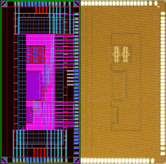
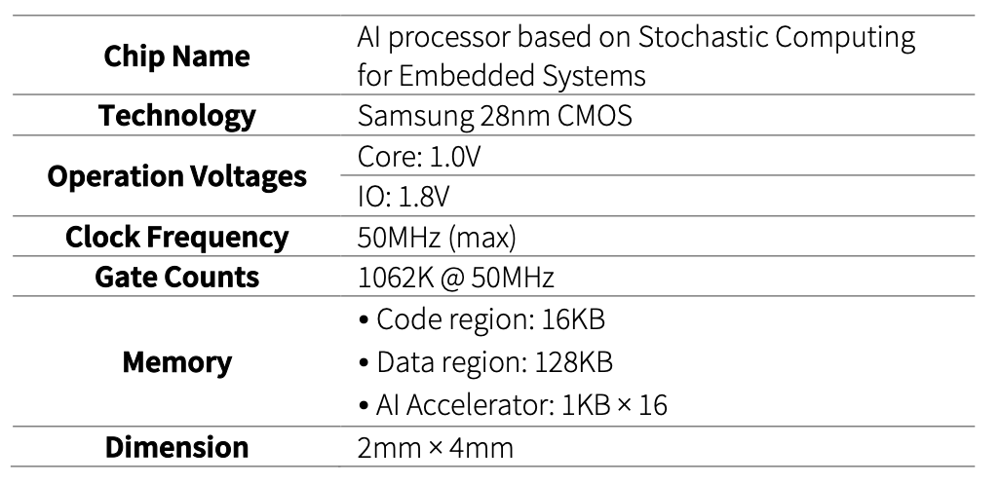
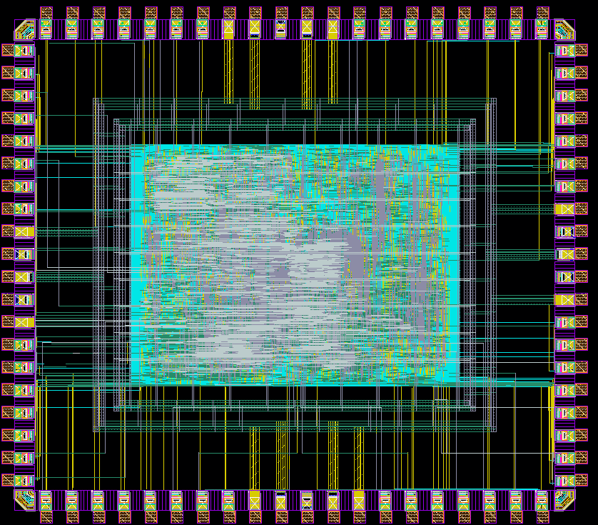
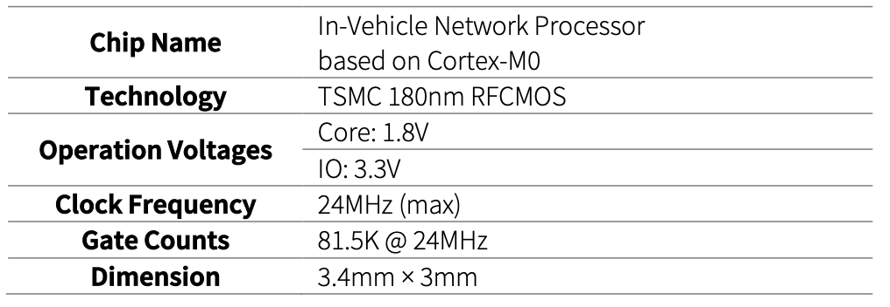

<!-- 첫 번째 프로젝트 -->
**Title**:
[AI processor based on Stochastic Computing for Embedded Systems](../images/asic/certificate_ss.png)  
**Fab-in**: 2022-07-18  
**Designer**: **Jeongeun Kim**, Kwonneung Cho, Changyeop Han, Won Sik Jeong

  
  

[\[View chip photo\]](../images/asic/ss_chip.png)  

---

<!-- 두 번째 프로젝트 -->
**Title**: 
[In-Vehicle Network Processor based on Cortex-M0](../images/asic/certificate_hm.png)   
**Fab-in**: 2022-03-16  
**Designer**: Cho Kwon Neung, **Jeongeun Kim**, Hyunwoo Oh

  
  

[\[View chip photo\]](../images/asic/hm_chip.png)   
