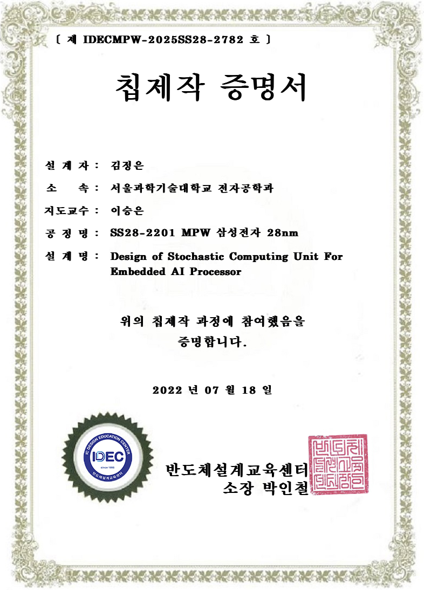
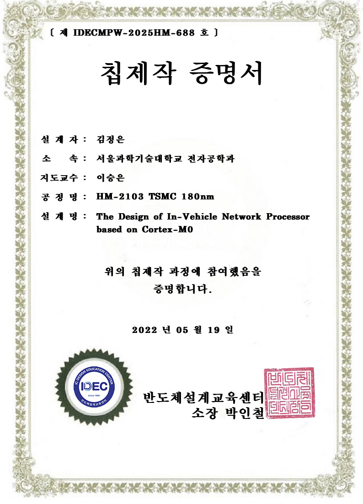

<!-- 첫 번째 프로젝트 -->
### Title: 

AI processor based on Stochastic Computing for Embedded Systems

**Fab-in**: 2022-07-18  
**Designer**: **Jeongeun Kim**, Kwonneung Cho, Changyeop Han, Won Sik Jeong

  
  

---

<!-- 두 번째 프로젝트 -->
### Title: 

In-Vehicle Network Processor based on Cortex-M0

**Fab-in**: 2022-03-16  
**Designer**: Cho Kwon Neung, **Jeongeun Kim**, Hyunwoo Oh

  
  

