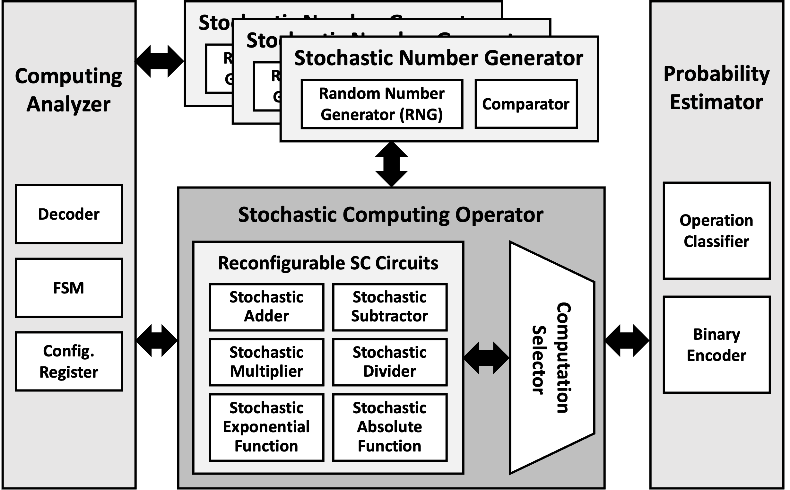

---
title: "Reconfigurable Stochastic Computing Architecture for Computationally Intensive Applications"
collection: research 
permalink: /research/2021-10-19-stochastic-isocc
excerpt: '

  
  

'

date: 2022-10-19
venue: '19th International SoC Design Conference (ISOCC 2022)'
paperurl: 'https://doi.org/10.1109/ISOCC56007.2022.10031563'
citation: '<strong>J. Kim</strong>, Y. R. Jeong, K. Cho, W. S. Jeong and S. E. Lee, "Reconfigurable Stochastic Computing Architecture for Computationally Intensive Applications," 2022 19th International SoC Design Conference (ISOCC), Gangneung-si, Korea, Republic of, 2022, pp. 61-62.'
---  
The design of computation-intensive and complicated applications is limited by hardware resources. To realize efficient utilization of circuit area with lightweight computational logics and execute optimized operation, we propose an architecture of reconfigurable stochastic computing (SC) unit. The proposed SC unit decodes mathematical formula and reconfigures SC circuits to improve design productivity. Compared to the deterministic implementation, the proposed architecture reduces the circuit area by 39.7%.  
[\[Slides]\](../images/isocc_stochastic/isocc_slides.pdf)
[\[Image from the conference presentation]\](../images/isocc_stochastic/ISOCC_presentation.jpg)  
